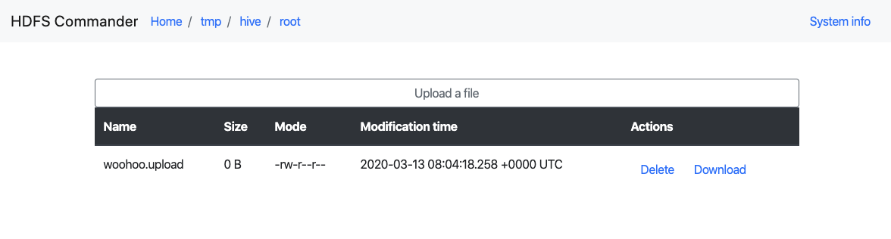

# HDFS-commander
Dead simple web interface which helps you to explore and manage your data on HDFS.  
Written for my beloved colleagues @ [lili-data](https://github.com/lili-data/)  

## Config
- Environment variables
  - `HDFS_URL`
  - `HDFS_USER`
  - `HTTP_SERVER_PORT` (optional)

## Install
You have 3 options here:
1. Run local:
   1. Compile the app
   2. Set the environment variables
   3. Start
2. Run with Docker:
   1. Pull the image: `docker pull pyrooka/hdfs-commander`
   2. Start a container with the environment variables set
3. Run in Kubernetes (deploy with Helm):
   1. Modify the `hdfsCommander` section in the `hdfs-commander/values.yaml`
   2. `helm install hdfs-commander ./hdfs-commander`

## Functions
- File system info
- Browse the file system
  - Upload file from local
  - Delete file or directory from HDFS
  - Download file from HDFS to local

## Ideas
- mkdir
- Rename
- Custom javascript
  - upload, delete?
  - custom collapsible ([?](https://www.w3schools.com/howto/howto_js_collapsible.asp))
- More detailed file info
- SVG for delete/download/info/upload buttons
